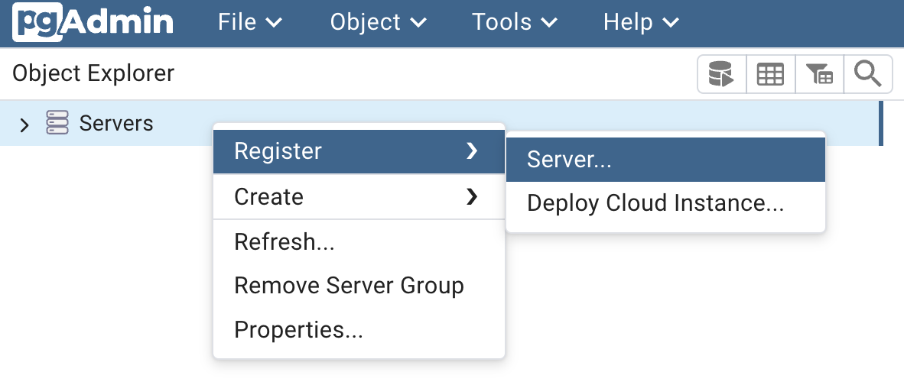
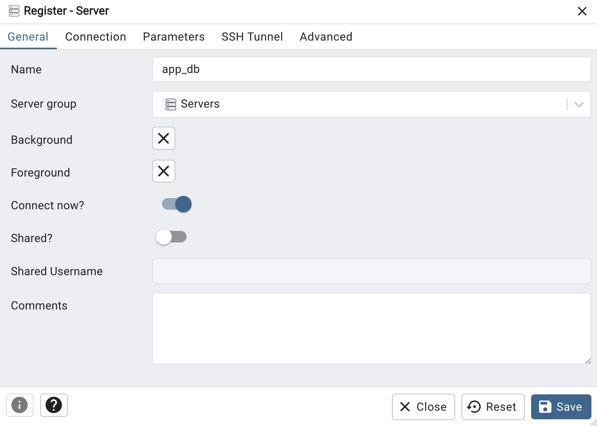
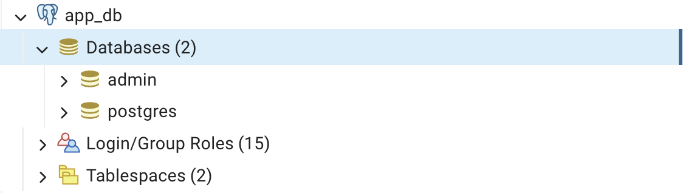

#  Ruby on Rails Boilerplate with Docker

By : **Tatiya Seehatrakul**

---

## 📍 Pre-requisites

- [Docker](https://www.docker.com/)
- [Ruby](https://www.ruby-lang.org/en/)
- [Rails](https://rubyonrails.org/)
- [PostgreSQL](https://www.postgresql.org/)

---

## 📍 Database Setup

To start the PostgreSQL database server:

1. Navigate to the `db` directory:

   ```bash
   cd db
   ```

2. Run the database container:

   ```bash
    docker compose down --remove-orphans
    docker compose up --build -d
    docker compose up -d
   ```

3. Local database server will be available at:  **http://localhost:8088**

4. Login to PgAdmin Server
    - PGADMIN_DEFAULT_EMAIL: **admin@admin.<area>com**
    - PGADMIN_DEFAULT_PASSWORD: **admin123**
        <p align="left">
            
        </p>

5. Connect to database
    - Register a new server: Servers &rarr; Register &rarr; Server
        <p align="left">
            
        </p>

    - Set configuration
        - host: **app_db**
        - database: **app_development**
        - POSTGRES_USER=**admin**
        - POSTGRES_PASSWORD=**password**
        <p align="left">
            
            
        </p>

    - Successfully connected to database
        <p align="left">
            
        </p>

---

## 📍 Running the Rails Application

1. Navigate to the Rails app directory:

   ```bash
   cd students
   ```

2. On the first run, build the app image:

   ```bash
   docker compose build
   ```

3. Start the Rails container:

   ```bash
   docker compose up -d
   ```

The Rails app will be accessible at:  
**http://localhost:3000**

---

## 📍 Accessing the Rails Container

To run Rails commands (e.g., generate models, migrate DB):

1. Enter the running container:

   ```bash
   docker exec -it students-app bash
   ```

2. To generate a new scaffold (example):

   ```bash
   ./bin/rails generate scaffold course name:string credits:integer
   ```

3. To apply database migrations:

   ```bash
   bundle exec rake db:migrate
   ```

4. Exit the container:

   ```bash
   exit
   ```

---

## 📍 Stopping All Containers

From the directory where your `docker-compose.yml` is located, run:

```bash
docker compose down --remove-orphans
```

This will shut down all containers and remove unused ones.

---