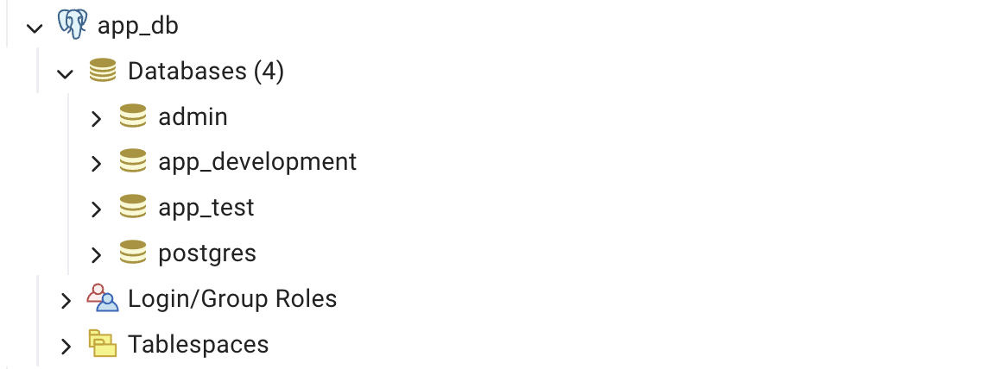

# 💬 ChatStream : Real-Time Chat & Livestreaming App

- **By : Tatiya Seehatrakul st124875**
- This project is developed to fulfill the requirements of the AT70.15	Advanced Topics in Internet Technology course at the Asian Institute of Technology (AIT) for the January 2025 semester.

## 📍 Project Overview
**ChatStream** is a real-time Rails application with Devise authentication, supporting instant messaging and one-way livestreaming via WebRTC. Authenticated users can create rooms, send messages, and stream video as broadcasters. Viewers connect peer-to-peer using ICE/STUN, with canvas fallback for cross-browser video rendering.

---

#  Ruby on Rails Boilerplate with Docker

## 📍 Pre-requisites

This project requires the following tools to be installed before setup:

* [](https://www.docker.com/)
* [](https://www.ruby-lang.org/en/)
* [](https://rubyonrails.org/)
* [](https://www.postgresql.org/)

---

## 📍 Database Setup

To start the PostgreSQL database server:

1. Navigate to the `db` directory:

   ```bash
   cd db
   ```

2. Run the database container:

   ```bash
    docker compose down --remove-orphans
    docker compose up --build -d
    docker compose up -d
   ```

    <div style="background-color: #fff9c4; padding: 10px; border-radius: 8px; border-left: 6px solid #fbc02d;">
    <strong>Note:</strong> Local database server will be available at: <strong>http://localhost:8088</strong>
    </div>   
    <br> 

3. Login to PgAdmin Server
    - PGADMIN_DEFAULT_EMAIL: **admin@admin.<area>com**
    - PGADMIN_DEFAULT_PASSWORD: **admin123**
        <p align="left">
            
        </p>
        <br> 

4. Connect to database
    - Register a new server: Servers &rarr; Register &rarr; Server
        <p align="left">
            
        </p>
        <br> 

    - Set configuration
        - host: **app_db**
        - database: **app_development**
        - POSTGRES_USER=**admin**
        - POSTGRES_PASSWORD=**password**
        <p align="left">
            
            
        </p>

    - Successfully connected to database
        <p align="left">
            
        </p>      

---

## 📍 Running the Rails Application

1. Navigate to the Rails app directory:

   ```bash
   cd app
   ```

2. On the first run, build the app image:

   ```bash
   docker compose build
   ```

3. Start the Rails container:

   ```bash
   docker compose up
   docker compose up -d
   ```
    <div style="background-color: #fff9c4; padding: 10px; border-radius: 8px; border-left: 6px solid #fbc02d;">
    <strong>Note:</strong> Local Rails server will be accessible at: <strong>http://localhost:3003</strong>
    </div>
    <br>   
4. All databases will be automatically generated when Rails application is created
    <p align="left">
        
    </p>   

---

## 📍 Accessing the Rails Container
To run Rails commands (e.g., generate models, migrate DB):

1. **Enter the running container:**

   ```bash
   docker exec -it app_web bash
   ```

2. **Generate a new scaffold (example):**

   ```bash
   ./bin/rails generate scaffold course name:string credits:integer
   ```

3. **Run database migrations:**

   ```bash
   bundle exec rake db:migrate
   ```

4. **Exit the container:**

   ```bash
   exit
   ```

---

### 🐳 Basic Docker Commands

- **Build Docker images:**
  ```bash
  docker compose build
  ```

- **Create and run containers:**
  ```bash
  docker compose up
  docker compose up -d
  ```

- **Stop and remove containers:**
  ```bash
  docker compose down --remove-orphans
  ```

- **Access container for Rails commands:**
  ```bash
  docker exec -it app_web bash
  ```

- **Exit container:**
  ```bash
  exit
  ```

---